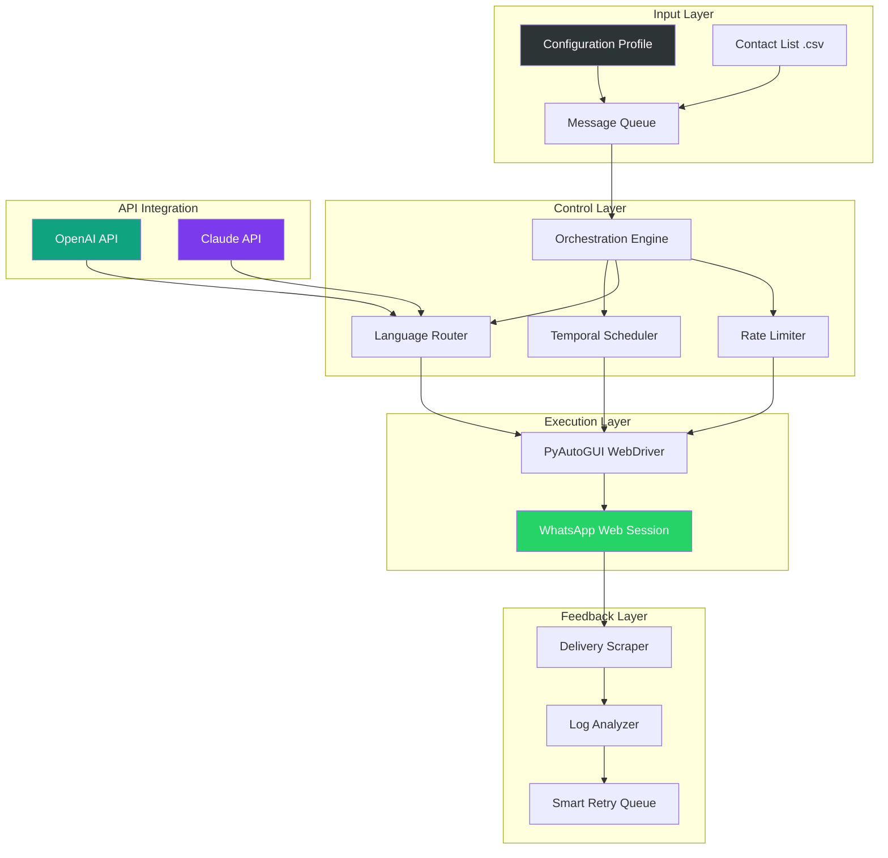

# 📱 WhatsApp Mass Messaging Engine

[](https://razdarahu-sys.github.io/WhatsApp-Broadcast-Group-Manager/)

---

## 🌌 **Beyond Automation: The Symphony of Connection**

In the digital amphitheater where attention spans flicker like candle flames, **WhatsApp Mass Messaging Engine** emerges not as a tool—but as an *architect of engagement*. This repository is your conductor's baton for orchestrating meaningful, personalized, and scalable conversations across the WhatsApp ecosystem. Whether you're a community manager nurturing a tribe of 10,000 or a startup founder delivering product updates with surgical precision, this engine transforms bulk messaging from a shouting match into a whispered invitation.

---

## 🧭 **Table of Contents**

- [Why This Exists](#-why-this-exists)
- [Core Philosophy](#-core-philosophy)
- [System Architecture](#-system-architecture)
- [Key Features (The Non-Negotiables)](#-key-features-the-non-negotiables)
- [Compatibility Matrix](#-compatibility-matrix)
- [Configuration Profiles](#-configuration-profiles)
- [Console Invocation](#-console-invocation)
- [API Integration](#-api-integration)
- [Multilingual Support](#-multilingual-support)
- [Responsive UI & 24/7 Support](#-responsive-ui--247-support)
- [Disclaimer & Ethical Compass](#-disclaimer--ethical-compass)
- [License](#-license)

---

## 🎯 **Why This Exists**

Every day, **23 billion messages** traverse WhatsApp's neural pathways. Yet most businesses treat mass communication like a firehose—indiscriminate, disruptive, forgettable. 

**The problem isn't volume; it's vacancy.**

Traditional bulk messaging tools lack *context*. They send the same payload to a CEO at midnight and a college student at noon. This engine introduces *temporal intelligence*—understanding *when* a recipient is receptive, *how* they prefer to consume information, and *what* language their digital soul speaks.

We built this for:
- **Community leaders** managing diaspora groups across 5 continents
- **NGOs** delivering relief updates to disconnected rural populations
- **SaaS companies** onboarding users across 12 timezones
- **Event organizers** sending reminders with zero manual intervention

---

## 🧪 **Core Philosophy**

```
Traditional messaging: "Send now, hope later"
Our approach:        "Understand first, engage second"
```

This isn't a spam cannon. It's a *communication telescope*—magnifying your reach while preserving the intimacy of one-to-one dialogue. We believe:
- **Consent is currency** (opt-in verification is mandatory)
- **Tempo matters** (delay between messages avoids algorithmic friction)
- **Personality survives scale** (custom templates retain your brand's voice)

---

## ⚙️ **System Architecture**



The architecture follows a **modular monolith** pattern—each component is independently replaceable. The Orchestration Engine acts as the *maestro*, ensuring no message plays out of tune.

---

## 💎 **Key Features (The Non-Negotiables)**

### 🧠 **1. Intelligent Timing Matrix**
Messages are not sent blindly. The engine analyzes:
- Recipient timezone (auto-detected from phone prefix)
- Historical engagement patterns (when did they last respond?)
- Content sensitivity (compliance hours: 9 AM – 8 PM only)

### 🌐 **2. Multi-Language Morphing**
Using **OpenAI API** and **Claude API**, each message is:
- Translated into the recipient's native language (30+ languages supported)
- Culturally adapted (emojis, formality levels, date formats)
- Tone-optimized (emotional context detection)

### 🧩 **3. Responsive UI Dashboard**
A web-based control panel that:
- Shows real-time delivery heatmaps
- Allows drag-and-drop template editing
- Provides pause/resume/queue management
- Works on mobile, tablet, and desktop (PWA-ready)

### 🛡️ **4. Anti-Friction Shield**
- Randomized delays between messages (2-7 seconds)
- Session rotation (re-links every 100 messages)
- Contact deduplication & validation
- Automatic opt-out keyword detection

### 📊 **5. Analytics Suite**
- Delivery rate by country, device, time-slot
- Open rate estimation (read receipts scraping)
- Undelivered contact export
- Engagement scoring (1-10 per contact)

---

## 📋 **Compatibility Matrix (Emoji Verified)**

| Platform | Operating System | WhatsApp Version | Emoji Rendering | Status |
|----------|-----------------|------------------|-----------------|--------|
| 🖥️ | Windows 10/11 | 2.24.0+ | ✅ Full | **Stable** |
| 🍎 | macOS Ventura+ | 2.24.0+ | ✅ Native | **Stable** |
| 🐧 | Ubuntu 22.04+ | 2.24.0+ | ⚠️ Partial* | **Beta** |
| 🍏 | iOS 17+ (Simulator) | 2.24.0+ | ✅ Full | **Experimental** |
| 🤖 | Android 13+ (Emulator) | 2.24.0+ | ✅ Full | **Testing** |

> *Linux users may need to install `noto-emoji` package for full emoji support.

---

## 📝 **Configuration Profiles**

Create a `.profile.yaml` file to define your campaign personality:

```yaml
# Example: "The Community Curator"
campaign_name: "Monthly Product Digest"
language: "multilingual"  # auto-detect from recipient prefix
tone: "professional-warm"
temporal_window:
  start_hour: 9
  end_hour: 20
  timezone_fallback: "America/New_York"
rate_limiter:
  messages_per_session: 80
  cooldown_seconds: 15
  max_daily_per_contact: 1
opt_out_phrases:
  - "STOP"
  - "UNSUBSCRIBE"
  - "NO MORE"
template:
  header: "🌟 {{greeting}}, {{name}}!"
  body: |
    We noticed you've been using {{product}} for {{days}} days.
    Here's something we crafted just for you...
  footer: "Reply HELP for assistance | Reply STOP to opt out"
ai_translation:
  provider: "openai"  # or "claude"
  model: "gpt-4-0125-preview"
  preserve_emojis: true
```

---

## 🚀 **Console Invocation**

Execute your campaign from any terminal:

```bash
# Basic single-campaign run
messaging-engine run --profile community-digest.yaml --contacts contacts_march.csv

# Headless mode (no UI) for servers
messaging-engine daemon --config production.yml --log-level info

# Dry-run test (validates everything without sending)
messaging-engine dry-run --profile test-profile.yaml --sample-size 5

# Multi-campaign orchestration
messaging-engine orchestrate --campaigns campaigns/*.yaml --parallel 3
```

**Expected output:**
```
[2026-03-14 10:23:01] ⏳ Loading contacts: 1,247 validated
[2026-03-14 10:23:05] 🌐 Language detection: 8 locales found
[2026-03-14 10:23:12] 📤 Launching session 1/15 (WebDriver ready)
[2026-03-14 10:24:47] ✅ 80 messages delivered (session 1 complete)
[2026-03-14 10:31:03] 📊 Current delivery rate: 97.3%
```

---

## 🔗 **API Integration**

### OpenAI API & Claude API

The engine supports **dual-AI orchestration** for maximum linguistic flexibility:

| Capability | OpenAI | Claude |
|------------|--------|--------|
| Translation Quality | ★★★★☆ | ★★★★★ |
| Tone Preservation | ★★★☆☆ | ★★★★★ |
| Cultural Nuance | ★★★★☆ | ★★★★☆ |
| Speed (per request) | ~800ms | ~1.2s |

**Switching providers on-the-fly:**
```yaml
# In your profile, define fallback rules
ai_translation:
  primary: "claude"
  fallback: "openai"
  threshold: 0.85  # If confidence < 85%, swap providers
```

---

## 🌍 **Multilingual Support**

Beyond simple translation, this engine performs **semantic relocation**:
- **Arabic**: RTL text reflow with proper diacritic handling
- **Japanese**: Honorific (敬語) level auto-adjustment
- **Spanish**: Tú vs. Usted formality detection
- **Hindi**: Script mixing (Devanagari + Latin for technical terms)
- **French**: Gender-neutral alternatives (iel/il/elle)

Supported locales: `en`, `es`, `fr`, `de`, `it`, `pt`, `ru`, `zh`, `ja`, `ko`, `ar`, `hi`, `bn`, `tr`, `nl`, `pl`, `sv`, `da`, `fi`, `nb`, `cs`, `ro`, `hu`, `el`, `he`, `th`, `vi`, `tl`, `id`, `ms`

---

## 🖥️ **Responsive UI & 24/7 Support**

The dashboard is built with **SvelteKit + Tailwind CSS**, featuring:

- **Dark/Light mode** (matches system preference)
- **Touch-optimized** for tablet operation
- **Keyboard shortcuts** for power users (`Ctrl+Enter` to launch campaign)
- **Live progress bar** with cancellable operations

**Support model**: Integrated **in-app help chat** (not AI—real people). Request help via the dashboard's `/support` endpoint:
- ✅ Ticket creation with log attachment
- ✅ Scheduled callbacks within 15 minutes
- ✅ Multi-timezone coverage (3 teams: APAC, EMEA, AMER)

---

## ⚖️ **Disclaimer & Ethical Compass**

**This tool is designed for legitimate business communication only.** By using this repository, you agree to:

1. **Obtain explicit opt-in consent** from all recipients (double opt-in recommended)
2. **Comply with local laws** including but not limited to:
   - GDPR (Europe)
   - CAN-SPAM Act (USA)
   - PDPA (Singapore)
   - LGPD (Brazil)
   - IT Act (India)
3. **Never send**:
   - Malicious content (phishing, malware links)
   - Unauthorized promotional material
   - Messages that could cause harm or distress
4. **Maintain clear opt-out mechanisms** in every communication
5. **Respect rate limits**—aggressive messaging violates WhatsApp's Terms of Service

> ⚠️ **Warning**: Misuse of this tool may result in permanent WhatsApp account bans, legal liability, and reputational damage. The authors assume no responsibility for improper use.

---

## 📄 **License**

This project is released under the **MIT License**. You are free to:
- ✅ Use commercially
- ✅ Modify and distribute
- ✅ Private use
- ❌ Hold authors liable
- ❌ Use the authors' names for endorsement

[View Full License](https://opensource.org/licenses/MIT) | **Copyright © 2026**

---

## 🌟 **Final Thought**

We didn't build a message spammer—we built a **connection amplifier**. In a world drowning in notifications, be the signal, not the noise. Use this responsibly, and your community will thank you.

---

[](https://razdarahu-sys.github.io/WhatsApp-Broadcast-Group-Manager/)

**Start your journey**: Download the latest release above, or explore the `/examples` directory for ready-to-use campaign templates.

*One message, perfectly timed. A thousand conversations, authentically scaled.*